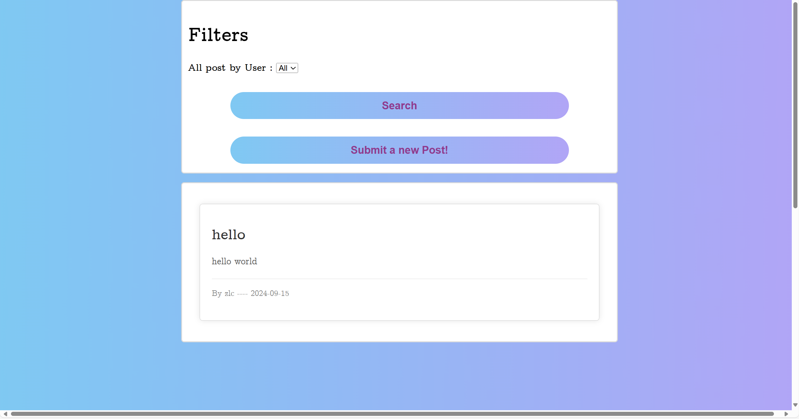
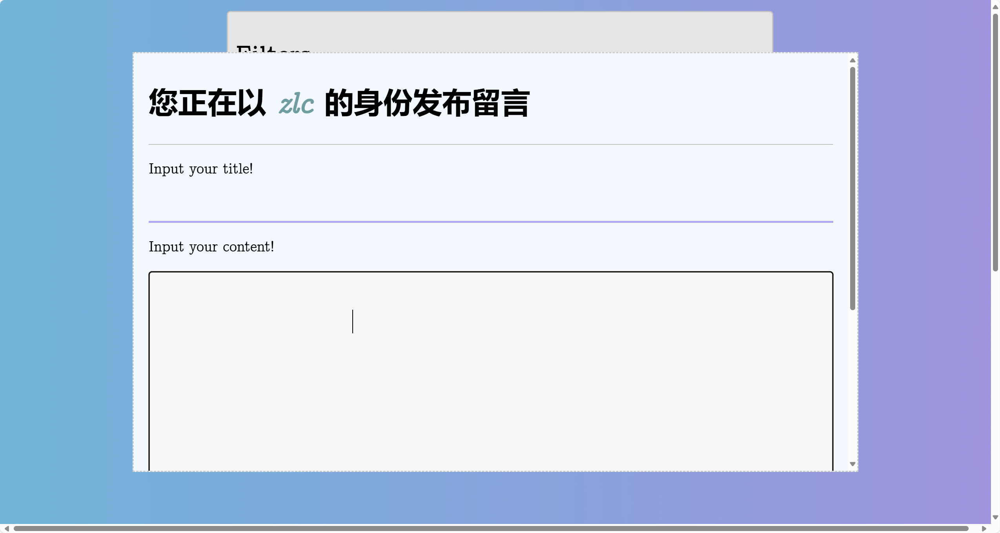

# 简易JSP留言板 by @DHU Buffalo
# 登录注册
- [login.jsp](src%2Fmain%2Fwebapp%2Flogin.jsp)
- [login.js](src%2Fmain%2Fwebapp%2Fpublic%2Flogin.js)


# 查看,新建留言,筛选
> 有个bug就是一定要点search才能跑的通




# 怎么跑起来
## 插入数据表
```sql
create database `webblog`;
use webblog;
create table if not exists user
(
    id       int auto_increment comment 'user_id'
        primary key,
    username varchar(250) null comment 'username',
    password varchar(250) null comment 'password'
)
    charset = utf8;

create table if not exists lytable
(
    id      int auto_increment comment 'user_id'
        primary key,
    userId  int            not null,
    dates   datetime       not null,
    title   varchar(250)   null,
    content varchar(10000) null,
    constraint lytable_ibfk_1
        foreign key (userId) references user (id)
)
    charset = utf8;

create index userId
    on lytable (userId);
```
## 配置数据库用户名,密码
[db.properties](src%2Fmain%2Fresources%2Fdb.properties)
```properties
driver=com.mysql.cj.jdbc.Driver
url=jdbc:mysql://localhost:3306/webblog?useUnicode=true&characterEncoding=utf-8
username=root
password=123456
```
## 修改BASE_URL
- 在[BASE_URL.js](src%2Fmain%2Fwebapp%2Fpublic%2FBASE_URL.js)中修改为你的`TOMCAT`路径,可以运行第一次之后再粘贴上去